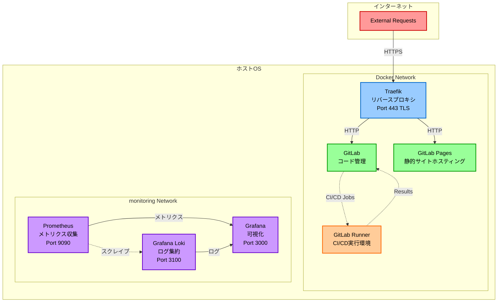

# servers

Dockerを使用したサーバー構成管理リポジトリ

## 概要

このリポジトリは、複数のサーバーコンポーネントをDockerコンテナで運用するためのセットアップスクリプトと設定ファイルを管理します。

## アーキテクチャ

## 構成

### Traefik
リバースプロキシとして機能し、すべてのトラフィックをルーティングします。
- SSL/TLS終端
- ドメイン管理
- リクエストルーティング

### GitLab
コード管理プラットフォーム

#### Runner
GitLab CIパイプラインの実行環境

#### Pages
静的サイトホスティング機能

### オブザーバビリティ

#### Prometheus
メトリクス収集・保存（Port 9090）

#### Grafana
メトリクス・ログの可視化ダッシュボード（Port 3000）

#### Grafana Loki
ログ集約・保存（Port 3100）

詳細は [docs/observability.md](docs/observability.md) を参照してください。

## 必要な環境

- Docker
- Docker Compose

## セットアップ

各コンポーネントの詳細なセットアップ方法については、該当するディレクトリ内のドキュメントを参照してください。

## ライセンス

詳細は[LICENSE](LICENSE)を参照してください。
